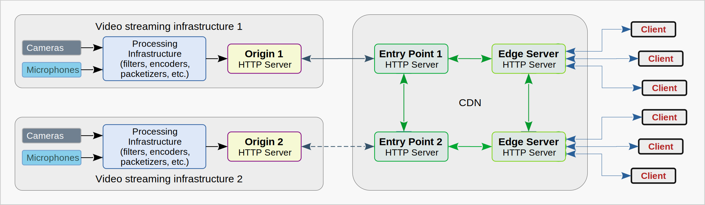
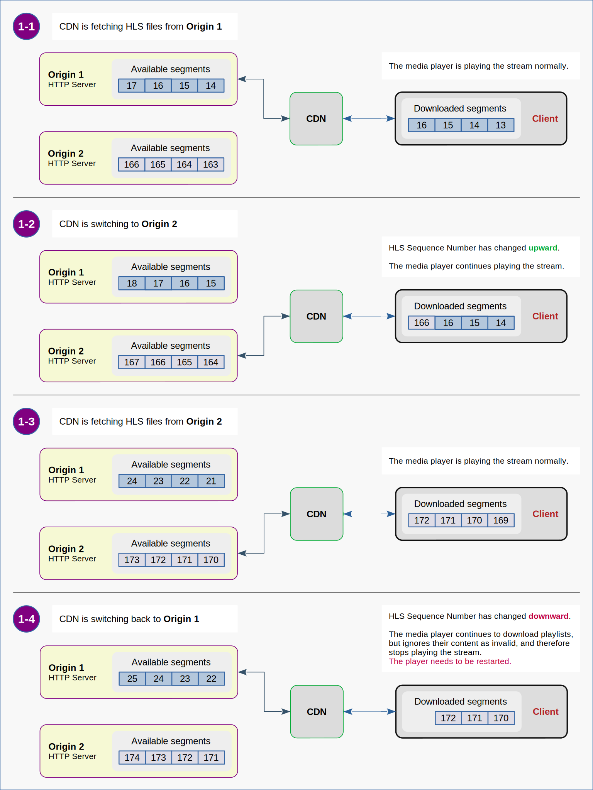
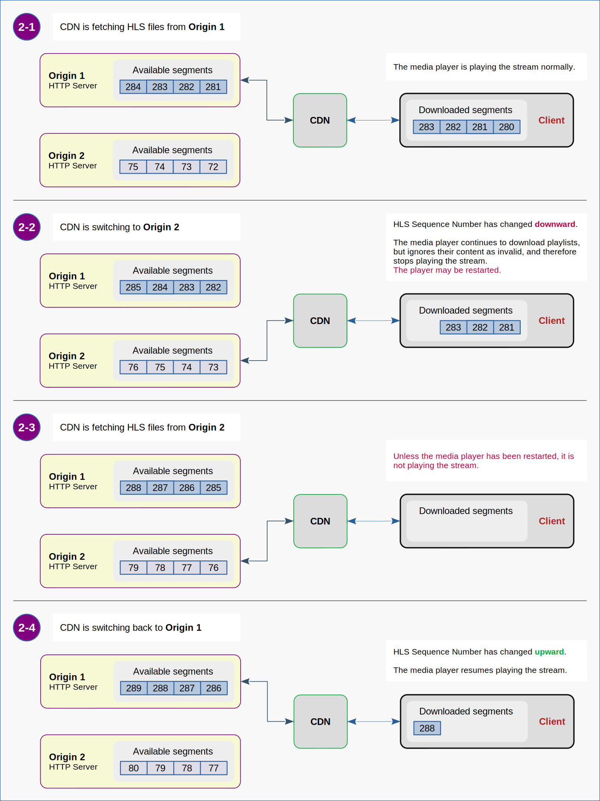
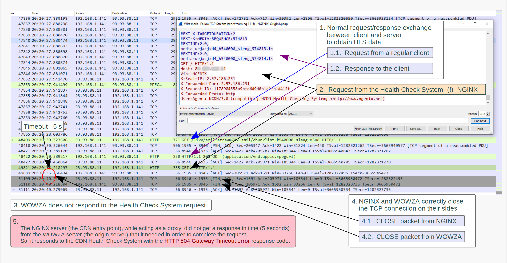
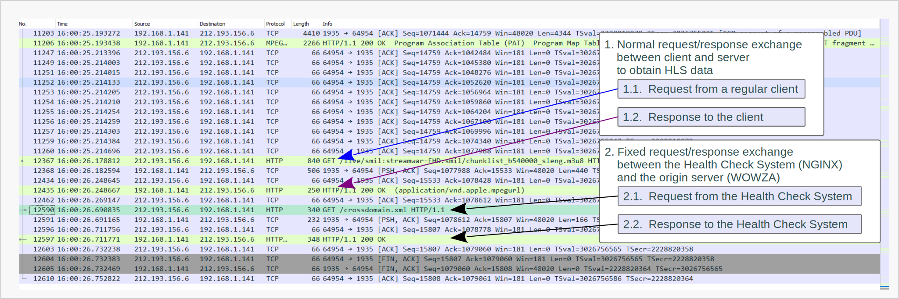
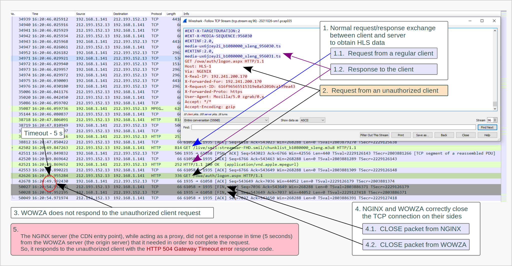
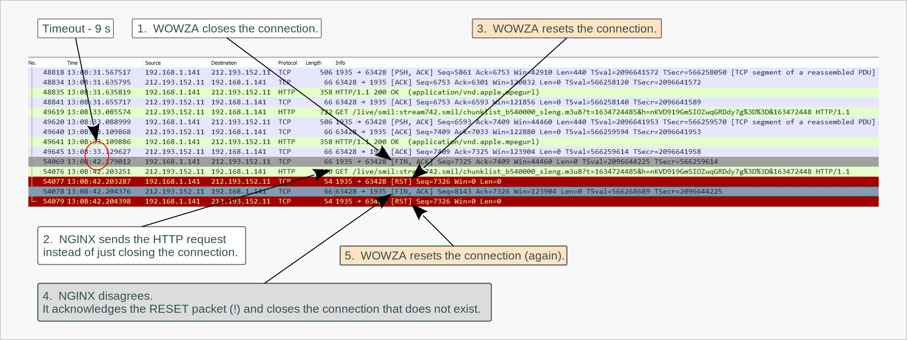
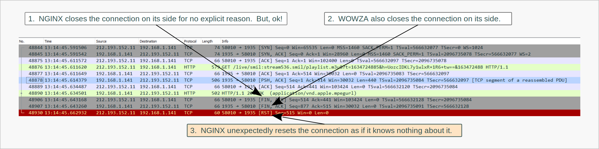

# What could be Wrong with HLS  

[1. Brief Description of the System](#1-brief-description-of-the-system)  
&nbsp;&nbsp;[1.1. Basic Requirements for an Architecture of the Video Streaming System](#11-basic-requirements-for-an-architecture-of-the-video-streaming-system)  
&nbsp;&nbsp;[1.2. Servers Software](#12-servers-software)  
&nbsp;&nbsp;[1.3. CDN Key Functionality](#13-cdn-key-functionality)  
&nbsp;&nbsp;&nbsp;&nbsp;[1.3.1. Cache](#131-cache)  
&nbsp;&nbsp;&nbsp;&nbsp;[1.3.2. Security Tokens](#132-security-tokens)  
&nbsp;&nbsp;&nbsp;&nbsp;[1.3.3. Load Balancing](#133-load-balancing)  
&nbsp;&nbsp;&nbsp;&nbsp;[1.3.4. Health Check](#134-health-check)  
&nbsp;&nbsp;[1.4. Providing Fault Tolerance for the Streaming System](#14-providing-fault-tolerance-for-the-streaming-system)  
&nbsp;&nbsp;&nbsp;&nbsp;[1.4.1. Actual Failover Implementation](#141-actual-failover-implementation)  
&nbsp;&nbsp;&nbsp;&nbsp;[1.4.2. Failover Triggers](#142-failover-triggers)  

[2. Known Issues](#2-known-issues)  
&nbsp;&nbsp;[2.1. Incompatibility of the HLS Protocol and Failover Principles](#21-incompatibility-of-the-hls-protocol-and-failover-principles)  

[3. The Playback Issue](#3-the-playback-issue)  
&nbsp;&nbsp;[3.1. Expectations vs Reality](#31-expectations-vs-reality)  
&nbsp;&nbsp;[3.2. Efforts to Identify the Malfunctioning Subsystem](#32-efforts-to-identify-the-malfunctioning-subsystem)  
&nbsp;&nbsp;&nbsp;&nbsp;[3.2.0. Identification of the Problem Cause](#320-identification-of-the-problem-cause)  
&nbsp;&nbsp;&nbsp;&nbsp;[3.2.1. Changes Check](#321-changes-check)  
&nbsp;&nbsp;&nbsp;&nbsp;[3.2.2. Network Check](#322-network-check)  
&nbsp;&nbsp;&nbsp;&nbsp;[3.2.3. Isolation of the entire CDN](#323-isolation-of-the-entire-cdn)  
&nbsp;&nbsp;&nbsp;&nbsp;[3.2.4. Isolation of the CDN Failover Subsystem](#324-isolation-of-the-cdn-failover-subsystem)  
&nbsp;&nbsp;[3.3. Network Traffic Analysis](#33-network-traffic-analysis)  
&nbsp;&nbsp;&nbsp;&nbsp;[3.3.1. Tools for Capturing and Analyzing Network Traffic](#331-tools-for-capturing-and-analyzing-network-traffic)  
&nbsp;&nbsp;&nbsp;&nbsp;[3.3.2. Weird Behavior of NGINX Server](#332-weird-behavior-of-nginx-server)  

[4. False Failovers](#4-false-failovers)  
&nbsp;&nbsp;[4.1. Troubles in HTTP Communication between NGINX and WOWZA](#41-troubles-in-http-communication-between-nginx-and-wowza)  
&nbsp;&nbsp;&nbsp;&nbsp;[4.1.1. False Failovers Caused by the CDN Health Check System](#411-false-failovers-caused-by-the-cdn-health-check-system)  
&nbsp;&nbsp;&nbsp;&nbsp;[4.1.2. False Failovers Caused by non Authorized Clients](#412-false-failovers-caused-by-non-authorized-clients)  
&nbsp;&nbsp;[4.2. Troubles in TCP Communication between NGINX and WOWZA](#42-troubles-in-tcp-communication-between-nginx-and-wowza)  
&nbsp;&nbsp;&nbsp;&nbsp;[4.2.0. Transmission Control Protocol (notes)](#420-transmission-control-protocol-notes)  
&nbsp;&nbsp;&nbsp;&nbsp;[4.2.1. NGINX Violates HTTP Specification](#421-nginx-violates-http-specification)  
&nbsp;&nbsp;&nbsp;&nbsp;[4.2.2. NGINX Violates TCP Specification](#422-nginx-violates-tcp-specification)  

[5. Incorrect Caching](#5-incorrect-caching)  

[6. Summary](#6-summary)  

---


#### &nbsp; Preface  
From time to time at work I have to deal with compatibility issues between software products.
Some problems arise because software developers do not anticipate exactly how their product will be used,
and users do not fully understand what exactly the software products they work with do.
People often rely on a brief description of the product's functionality
and simple examples from the "Getting Started" section of the documentation without delving into details.
Often this approach actually works.
However, when you come across strange and unpredictable behavior on the system that had worked well for a long time
and then suddenly broke for no apparent reason, you have to read a vast amount of documentation
and do thorough research to get it back up and running.  

One such case seemed to me remarkable enough to write the note dedicated to it.  

---


## 1. Brief Description of the System  

Before speaking about the problem itself,
a brief introduction is needed to give some ideas of the entities we will be dealing with in this note.  


### 1.1. Basic Requirements for an Architecture of the Video Streaming System  

Let us imagine that we want to have an extremely reliable 24/7 live video streaming system.
The system must be so reliable that the failure of one of its components does not lead to the termination of the broadcasting process.
The main requirement is that it should be possible to stop any of system components for maintenance,
repair or upgrade in a way that it is not noticeable to end users.  

Obviously these requirements are met by systems with **complete redundancy**.  

It is quite logical that such a system should consist of two (or more) independent infrastructures
for acquisition, processing, encoding, multiplexing and publishing video content.
In this particular case, content is delivered to end user devices through a
[content delivery network](https://en.wikipedia.org/wiki/Content_delivery_network)
(CDN) using the
[HTTP protocol](https://en.wikipedia.org/wiki/Hypertext_Transfer_Protocol).  

  
&nbsp;&nbsp;*Figure 1.1. : Block Diagram of the Redundant Infrastructure for Reliable Video Streaming*  

---


### 1.2. Servers Software  

This note is devoted to the system built on the following software products:  
* [Wowza Streaming Engines](https://www.wowza.com/streaming-engine) is used as a platform for origin servers.  
* [NGINX](https://www.nginx.com/) and [NGINX Plus](https://www.nginx.com/products/nginx/) are used as a platform for CDN nodes.  

---


### 1.3. CDN Key Functionality  

#### 1.3.1. Cache  

CDN reverse proxy servers forward unique HTTP requests from end user clients to origin servers.
Responses from the origin servers are returned to clients
and at the same time stored in the CDN cache for the time specified in
[the HTTP response headers](https://developer.mozilla.org/en-US/docs/Web/HTTP/Headers/Cache-Control).
Thus, the CDN allows us to serve tens of thousands of clients,
while the load on the origin servers remains more or less constant
and is equivalent to the load caused by a single client (ideally) per one published stream.  


#### 1.3.2. Security Tokens  

CDN edge servers filter requests from the end users using so called
[tokenization](https://en.wikipedia.org/wiki/Tokenization_(data_security)) technique.
This means that every HTTP request must contain a valid security token in the
[URL query string](https://en.wikipedia.org/wiki/Query_string) as a parameter.
If there is no security token in the request, or the token is invalid (for example, because it has already expired),
the CDN edge server responds to the client with a
[Forbidden error](https://developer.mozilla.org/en-US/docs/Web/HTTP/Status/403) `(HTTP status code 403)`.
This method allows us to restrict access to the content for unauthorized users and protect origin servers from
[Denial of Service attacks](https://en.wikipedia.org/wiki/Denial-of-service_attack).  


#### 1.3.3. Load Balancing  

The HTTP load balancing mechanism is based on the principle of distributing client requests between origin servers
in accordance with one of the load balancing algorithms.
This principle implies that there is a group of origin servers
that publish **identical** content. Let's call this group a *load balancing group*.  

CDNs built on NGINX servers can also forward client requests to one of the *backup servers*,
which normally do not participate in the load balancing process.
It happens when all servers in the load balancing group are considered unhealthy.  

The difference between the servers of the load balancing group and the backup servers is that
the content published by the backup servers may differ from the content published by the servers of the load balancing group **(!)**.
For example, backup servers may simply publish a message about the service unavailability due to maintenance or something like this.  


#### 1.3.4. Health Check  

The CDN Health Check System is responsible for temporarily excluding unhealthy origin servers from load balancing.
This CDN subsystem monitors network transactions between CDN nodes and servers of the load balancing group,
collects information about some special events at the TCP and HTTP layers,
and determines whether a particular origin server is considered healthy or not.  

Logic dictates that monitoring of transactions initiated by end users should be sufficient for this purpose.
However, the NGINX developers have added an
[active health check]((https://docs.nginx.com/nginx/admin-guide/load-balancer/http-health-check/)) feature
to NGINX Plus servers.
This means that some CDN servers periodically send special health check requests to the origin servers
to generate responses that can be verified.  

For more details read the [NGINX documentation](https://docs.nginx.com/nginx/admin-guide/load-balancer/http-load-balancer/).  

---


#### &nbsp; Note:  
At this point, I would like to emphasize that a live streaming application does not generate unique data for each client.
Instead, it generates only one data stream, which is cached by the CDN servers.
Thus, the load is balanced by the data caching mechanism.
In addition, two (or more) origin servers cannot be combined into a load balancing group
for the reason that they are elements of different infrastructures
and generate data streams that are actually different from each other.  

---


### 1.4. Providing Fault Tolerance for the Streaming System  

#### 1.4.1. Actual Failover Implementation  

The ability of the system to continue operating uninterrupted despite the failure of its individual components
is provided by the failover mechanism described in [Section 1.3.3.](text.md#133-load-balancing)  

As shown on the *Figure 1.1*,
**Origin 1** is a main server, the only server in the load balancing group,
and
**Origin 2** is a backup server.  

When the CDN Health Check System determines that
the **Origin 1** server is unavailable or has failed,
the CDN entry point servers start forwarding user requests to
the **Origin 2** server.
This CDN feature allows us to handle network issues and, if necessary,
disable one of the origin infrastructures without stopping the streaming process.  


#### 1.4.2. Failover Triggers  

The following is a set of criteria indicating that the origin server should be temporarily marked as inactive (or unhealthy):  
* TCP connection error  
* TCP connection timeout  
* HTTP status 502 ([Bad Gateway](https://developer.mozilla.org/en-US/docs/Web/HTTP/Status/502))  
* HTTP status 503 ([Service Unavailable](https://developer.mozilla.org/en-US/docs/Web/HTTP/Status/503))  
* HTTP status 504 ([Gateway Timeout](https://developer.mozilla.org/en-US/docs/Web/HTTP/Status/504))  

In general, this set is not strict. However, a discussion of other possible criteria is beyond the scope of this note.  

---


#### &nbsp; Examples:  

If it is necessary the CDN to forward HTTP requests to only one of the origin servers,
the access to the second origin server should be restricted using a firewall.
The Linux kernel firewall can be used for this purpose as a simple option.  

```shell
iptables -A INPUT -p tcp ! -s 127.0.0.1 --dport 1935 -j REJECT
```
This command adds a rule for the kernel to temporarily reject TCP connections on port 1935 from everywhere except itself.  
&nbsp;

```shell
iptables -D INPUT -p tcp ! -s 127.0.0.1 --dport 1935 -j REJECT
```
This command deletes the rule that was added by the command in previous example.  

[iptables man page](https://linux.die.net/man/8/iptables)  
[iptables-save man page](https://linux.die.net/man/8/iptables-save)  
[iptables-restore man page](https://linux.die.net/man/8/iptables-restore)  

If you need to reboot the server and keep the firewall rules,
they should be saved before the reboot and restored after the reboot.
Here are some good notes on this topic:  
[iptables - Debian wiki page](https://wiki.debian.org/iptables)  
[How to make iptables persistent after reboot on Linux](https://linuxconfig.org/how-to-make-iptables-rules-persistent-after-reboot-on-linux)

---


&nbsp;:::&nbsp;At first glance, this design looks very reliable.
And, probably, it would be so if all the components of this system were built within the framework of one integral project.  
&nbsp;:::&nbsp;However, in real life, this system was assembled from independent components that are not fully compatible and,
as it turns out, do not work consistently.  

---


## 2. Known Issues  

### 2.1. Incompatibility of the HLS Protocol and Failover Principles  

As you probably know, HTTP Live Streaming is done by publishing sequences of media segments and playlists
that contain the URIs of the media segments and the special tags needed to control the playback process.  

[RFC-8216 (Section 3)](https://datatracker.ietf.org/doc/html/rfc8216#section-3) states as follows:  
>Each segment in a Media Playlist has a unique integer Media Sequence Number.
The Media Sequence Number of the first segment in the Media Playlist is either 0 or declared in the Playlist.
The Media Sequence Number of every other segment is equal to the Media Sequence Number of the segment that precedes it plus one.  

>Each Media Segment MUST carry the continuation of the encoded bitstream
from the end of the segment with the previous Media Sequence Number,
where values in a series such as timestamps and Continuity Counters MUST continue uninterrupted.
The only exceptions are the first Media Segment ever to appear in a Media Playlist and Media Segments
that are explicitly signaled as discontinuities.
Unmarked media discontinuities can trigger playback errors.  

[RFC-8216 (Section 6.2.2)](https://datatracker.ietf.org/doc/html/rfc8216#section-6.2.2) states as follows:  
> If Media Segments are to be removed, the Playlist file MUST contain an EXT-X-MEDIA-SEQUENCE tag.
  Its value MUST be incremented by 1 for every Media Segment that is removed from the Playlist file;
  it MUST NOT decrease or wrap.  

Once again, **_the value of `EXT-X-MEDIA-SEQUENCE` tag MUST NOT decrease or wrap._**  

It should be noted once again that **Origin 1** and **Origin 2** are elements
of completely independent infrastructures, and, as a result, publish **different** sequences of media segments.
Thus, when the CDN switches from one origin to another, the client detects that the HLS sequence has changed.
Depending on whether the HLS sequence changes upward or downward, two situations are possible,
but both of them inevitably lead to a playback error.  


  
&nbsp;&nbsp;*Figure 2.1.(1) : Switching to an alternative origin server results in playback errors for live HLS streams*  



&nbsp;&nbsp;*Figure 2.1.(2) : Switching to an alternative origin server results in playback errors for live HLS streams*  


#### &nbsp; Possible Solution: &nbsp;**(x)**  

Theoretically, such errors can be avoided
if **all** media playlists contain the **EXT-X-DISCONTINUITY** tag.
([RFC-8216 section-4.3.2.3](https://datatracker.ietf.org/doc/html/rfc8216#section-4.3.2.3)).
Perhaps, it can be done using
[cupertinoManifestHeaders](https://www.wowza.com/docs/how-to-add-custom-playlist-headers-to-apple-hls-manifests)
property of the Wowza **LiveStreamPacketizer** module on **Origin 1** and **Origin 2**.  

At the time of writing this note, the specified feature has not been implemented in the described system.
This approach has NOT been experimentally tested.  


#### &nbsp; Update (4607):  

After a closer look at the documentation and some experimental efforts,
I have come to the conclusion that this approach cannot be used to solve this particular problem.  

---


## 3. The Playback Issue  

### 3.1. Expectations vs Reality  

#### &nbsp; Expectations:  

When designing the streaming system architecture,
I assumed that the CDN would switch between origins very infrequently.
This assumption was based on the fact that the origin servers and communication channels in general are highly reliable,
and the CDN services work exactly as explained by sales managers and technical support specialists of the service provider.  

&nbsp;:::&nbsp;I considered it acceptable that end users would need to restart their media players
if there was a fire or flood, or the dude on the backhoe broke the optical communication cable.  


#### &nbsp; Reality:  

For three years everything looked as if I were not mistaken.
As expected, the system worked stably,
with the exception of very rare and very short incidents that were not noticeable to end users.  

But one day something happened that made it impossible to play streams longer than five minutes! **(!)**  
No regularity in these events was observed.
Sometimes they were not observed for several hours, and sometimes they occurred several times within a minute.  

---


### 3.2. Efforts to Identify the Malfunctioning Subsystem  

#### 3.2.0. Identification of the Problem Cause  

A superficial analysis of the situation showed that
most of the playback errors occur as a result of CDN failovers to the backup origin server.  


#### 3.2.1. Changes Check  

CDN technical support specialists claimed that
no changes were made on their part to the configuration of services, as well as to software and hardware. 
On the other hand, I knew that there were no changes on the side of the origin servers either.  


#### 3.2.2. Network Check  

Several network health check tests have shown that communication channels work reliably.  
The [Traceroute](https://traceroute.sourceforge.net/) utility for Linux was used
to collect statistics on TCP packet loss and network latency.
The following command was run at intervals of a few seconds for about one week.  

```shell
 traceroute --tcp -n -q 1 -w 1 DESTINATION_IP
```

The connectivity between origin servers and CDN servers has been tested using this method in both directions.
Collected data were analyzed and it turned out that the number of lost packets is vanishingly small.
Therefore, I concluded that there are no failures at the network layer that could cause the troubles.  


#### 3.2.3. Isolation of the entire CDN  

The operability of the HLS streaming system, with the exception of the CDN, was verified using playback tests.
Clients connected directly to the origin servers from several different remote locations in the world
and played the streams continuously for several days without any hiccups.  


#### 3.2.4. Isolation of the CDN Failover Subsystem  

The operability of the HLS streaming system including CDN,
with the exception of the failover mechanism (no backup server), was verified using playback tests.
Clients connected to the origin servers via CDN
and played the streams continuously for several days without any hiccups.  

---


#### &nbsp; Conclusions:  

Based on the tests above,
I have concluded that the issue is caused not by infrastructure changes or network outages,
but by a malfunction in the CDN failover mechanism.  

Unfortunately, the CDN support specialists were unable to find out the reasons for what was happening
and, as a result, could not offer any adequate solution to the problem.  

---


### 3.3. Network Traffic Analysis  

#### 3.3.1. Tools for Capturing and Analyzing Network Traffic  

At this stage, it became clear
that I am dealing with some **miscommunication** between the origin servers
([Wowza Streaming Engine](#12-servers-software)) and the CDN Health Check System ([NGINX](#12-servers-software)).  

Hoping to clarify the situation,
I decided to analyze the TCP streams during which the triggers described in
[section 1.4.2](#142-failover-triggers) were activated.
To collect data for further analysis, the network traffic has been recorded between the CDN and the origin servers,
and simultaneously between the client device and the CDN edge,
while a test video stream has been played on the client device.  

These tests were carried out using the powerful and informative tools for capture and analysis of network traffic:  
- [tcpdump](https://www.tcpdump.org/)
  (CLI packet analyzer) was used to capture network traffic in Linux OS. 
- [TShark](https://www.wireshark.org/)
  (CLI network protocol analyzer) was used to capture network traffic in Windows OS. 
- [Wireshark](https://www.wireshark.org/)
  (GUI network protocol analyzer) was used to analyze TCP packets carrying HTTP traffic. 


#### Examples:  

---


#### &nbsp; tcpdump  

```shell
tcpdump \
  -i NET_INTERFACE \
  -n \
  -w FILE_NAME.pcap \
  -C 100 \
  -W 1000 \
  net \
    CDN_NET_1_IP/MASK_1 \
    or \
    CDN_NET_2_IP/MASK_2 \
    or \
    host TEST_HOST_IP
```

Here is what this command means:
`tcpdump`, please, capture link-layer frames
that are being transmitted and received via specified network interface (`-i NET_INTERFACE`),
do not convert IP addresses to host names (`-n`),
write packets to a [PcapNG-format](https://pcapng.com/) file
with the specified name (`-w FILE_NAME.pcap`) rather than parsing and printing them out,
save data to multiple files that are not much larger than 100 millions bytes (`-C 100`),
do not create more than 1000 files (`-W 1000`), just overwrite oldest ones,
keep only those packets that are received from or sent to hosts from
the specified networks (`net CDN_NET_1_IP/MASK_1 or CDN_NET_2_IP/MASK_2`)
or the specified single host (`or host TEST_HOST_IP`).  
 
[tcpdump man page](https://www.tcpdump.org/manpages/tcpdump.1.html)  


#### &nbsp; Note:  

Due to the fact that access to network traffic can be used by unscrupulous programs for their insidious purposes,
operating systems confines user applications to have access to this resource (and to all system resources in general).
In my particular case, the operating system uses the [AppArmor](https://apparmor.net/) framework
to control access to its resources.  
[AppArmor in Debian wiki](https://wiki.debian.org/AppArmor)  
[AppArmor in Debian Admin Handbook](https://debian-handbook.info/browse/stable/sect.apparmor.html)  

Without going into details, in order to allow `tcpdump` to intercept network traffic,
it is necessary to disable the restrictive `AppArmor` profile for `tcpdump` as follows:  

```shell
apparmor_parser -R /etc/apparmor.d/usr.sbin.tcpdump
```
*(The path where tcpdump is installed may be different in your operating system.)*

[apparmor_parser man page](https://man.archlinux.org/man/apparmor_parser.8.en)  

---


#### &nbsp; Wireshark  

```bat
"C:\Program Files\Wireshark\tshark.exe" ^
  -i \Device\NPF_{GUID_OF_YOUR_NPF} ^
  -n ^
  -w FILE_NAME.pcap ^
  -b filesize:100000 ^
  -b files:20 ^
  host ^
    CDN_EDGE_NAME_OR_IP ^
    or ^
    ORIGIN_1_IP ^
    or ^
    ORIGIN_2_IP
```

Here is what this command means:
`tshark`, please, capture link-layer frames
that are being transmitted and received via specified network interface (`-i \Device\NPF_{GUID_OF_YOUR_NPF}`),
do not convert IP addresses to host names (`-n`),
write packets to a [PcapNG-format](https://pcapng.com/) file
with the specified name (`-w FILE_NAME.pcap`),
save data to multiple files that are not much larger than 100 000 kilobytes (`-b filesize:100000`),
do not create more than 20 files (`-b files:20`), just overwrite oldest ones,
keep only those packets that are received from or sent to the specified hosts
(`host CDN_EDGE_NAME_OR_IP or ORIGIN_1_IP or ORIGIN_2_IP`).  

The network interface in the command above is a string that looks something like this
`\Device\NPF_{780B1DA2-3A9D-48C4-9334-A1944F95614C}`.  
This part, `780B1DA2-3A9D-48C4-9334-A1944F95614C`,
is the GUID (Globally Unique ID) of NPF (Network Packet Filter).  
&nbsp;:::&nbsp;Oh yeah! Microsoft loves this kind of balderdash!&nbsp; &#x1F440;  

Long story short, just check the list of interfaces on which
[TShark](https://www.wireshark.org/docs/wsug_html/#AppToolstshark)
can capture as follows:  

```bat
"C:\Program Files\Wireshark\tshark.exe" -D
```

[TShark man page](https://www.wireshark.org/docs/man-pages/tshark.html)  
[Wireshark man pages](https://www.wireshark.org/docs/man-pages/)  
[Wireshark User’s Guide](https://www.wireshark.org/docs/wsug_html/)  


#### &nbsp; Note:  

By the way, to be able to work with these programs,
you must have **Administrator** privileges in Windows OS
and **root** privileges in Linux OS.  

---


#### 3.3.2. Weird Behavior of NGINX Server  

As the first result of the collected data analysis,
several unexpected strange features of NGINX servers behavior were revealed.  

- NGINX stops sending packets inside an open TCP connection without closing it,
  but opens a new TCP connection for further communication.  
  &nbsp;:::&nbsp;It is hard to imagine that there is any adequate reason to do so.  

- NGINX opens and closes many very short TCP connections that serve only one or two HTTP requests.  
  &nbsp;:::&nbsp;This seems to be a very wasteful way of using resources to control network traffic.  

This behavior looks weird, but does not lead to any critical consequences, at least for low-loaded systems.  

However, some other features cause events that the CDN Health Check System falsely interprets as
an **unhealthy state** of the origin servers or the communication channels.  

In the next sections, I will discuss several of these phenomena.  

---


## 4. False Failovers  

### 4.1. Troubles in HTTP Communication between NGINX and WOWZA  

#### 4.1.1. False Failovers Caused by the CDN Health Check System  

The engineer's intuition tells that HTTP requests from **different clients**
should be transferred by reverse proxy servers to origin servers on **different TCP streams**.
At least it seems logical to me. In fact, this is exactly what happens in the vast majority of cases.  

However, as it turned out,
sometimes NGINX reverse proxy servers pass HTTP requests from **different clients**
within the **same TCP connection** **(!)**.
In some special cases, this leads to
the [Gateway Timeout errors](https://developer.mozilla.org/en-US/docs/Web/HTTP/Status/504)
`(HTTP status code 504)` generated by CDN entry point servers.  


#### &nbsp; Here is what happens:  

By default, the CDN Health Check System requests the root URL of the origin server.  
`"GET / HTTP/1.1"`  

The WOWZA origin server typically responds to such a request with a short HTML document
containing information about itself (the software name, version and build number).
This works when an HTTP request from the CDN Health Check System is sent within an individual TCP connection
or at the very beginning of the TCP stream, which is then used for an HLS data exchange.  

But if such a request from the CDN Health Check System comes after
the HLS communication has already begun in the current TCP stream,
then WOWZA does **not** respond to this request **(!)**.
The NGINX entry point server then closes the TCP connection after a 5 second timeout
and responds with HTTP status code 504 to the CDN Health Check System.
Although the HLS data exchange between NGINX and WOWZA continues over other TCP connections,
the CDN Health Check System, upon receiving the Gateway Timeout error from the entry point server,
initiates a [CDN failover](#14-providing-fault-tolerance-for-the-streaming-system) to the backup origin server.  

  
&nbsp;&nbsp;*Figure 4.1.1.(1) : Here is an example of how **not** to check the HTTP server health.*  


#### &nbsp; &#x2705; &nbsp; Workaround:  

To resolve this issue,
the CDN Health Check System has been configured to request the file _crossdomain.xml_.  
`"GET /crossdomain.xml HTTP/1.1"`  

This file (_crossdomain.xml_) is intended for use by
[Adobe Flash](https://en.wikipedia.org/wiki/Adobe_Flash)
and
[Microsoft Silverlight](https://en.wikipedia.org/wiki/Microsoft_Silverlight) applications.
Although both of these platforms are discontinued and no longer supported by browsers,
WOWZA still provides compatibility with them.
And surprisingly, WOWZA always responds to such HTTP requests **(!)**.  

  
&nbsp;&nbsp;*Figure 4.1.1.(2) : `crossdomain.xml` is a magic word for WOWZA.*  

After applying this fix, the quality of CDN services was improved, but not significantly.
In percentage rate, there are significantly fewer such events than those that are described in the next section.  


#### &nbsp; Comments:  

The issue described in this section is a consequence of the simultaneous manifestation
of two strange features of the NGINX server software such as
an active health check and
a tendency to transfer HTTP requests from different clients within the same TCP connection.  

Here is my humble opinion on the matter:  

- The [active health check](#134-health-check) is
  an [overengineering](https://en.wikipedia.org/wiki/Overengineering) feature. 
  &nbsp;:::&nbsp;It is an overkill that has no practical meaning.
  At least I do not see any additional benefits from this functionality in comparison with
  a passive health check (verification of responses to requests from ordinary clients).  

- Sharing the same TCP connection between requests from different clients is an architectural mistake. 
  &nbsp;:::&nbsp;The only benefit of passing HTTP requests from different clients within the same TCP connection is
  to save the resources needed to manage multiple TCP connections.
  However, given how wasteful this resource is used to manage a huge number of ultra-short connections and
  to create new connections without a pressing need (as described in [section 3.3.2.](#332-weird-behavior-of-nginx-server)),
  this type of the TCP connection sharing seems completely pointless.  


#### 4.1.2. False Failovers Caused by non Authorized Clients  

Despite the fix described above, this was not the end of story.  

As it turned out, significant number of the failover events were triggered by
the same mechanism as described in [section 4.1.1.](#411-false-failovers-caused-by-the-cdn-health-check-system),
with the only difference that
malicious HTTP requests were forwarded to the origin servers from unauthorized external clients.  
And of course, they were left unresponded.  

These were requests like the following:  
`"GET / HTTP/1.1"`  
`"GET /favicon.ico HTTP/1.1"`  
`"GET /server-status HTTP/1.1"`  
`"GET /manager/html HTTP/1.1"`  
`"GET /sitemap.xml HTTP/1.1"`  
`"GET /.well-known/security.txt HTTP/1.1"`  
and so on.  


#### &nbsp; &#x1F6A9; &nbsp; Security Issue:  

Suddenly, I discovered that
the filtering process based on [security tokens](#132-security-tokens) was applied **not** to all requests
**(!)** as I expected,
but only to those that match some regular expression describing URI-s of an HLS playlists.  

So anyone on the Internet could send an arbitrary request to the CDN edge server,
and the CDN would forward that request to one of the origin servers.  

Obviously, this vulnerability could be exploited to perform a [DoS attack](https://en.wikipedia.org/wiki/Denial-of-service_attack).  

  
&nbsp;&nbsp;*Figure 4.1.2. : Here is an example of how **not** to configure filtering of incoming requests.*  


#### &nbsp; &#x2705; &nbsp; Solution:  

To resolve this issue, the CDN security subsystem was configured to use _global tokenization_ approach. 

This means that the CDN should only forward requests to origin servers
if they contain a valid token as one of the parameters in
an [URI query string](https://en.wikipedia.org/wiki/Query_string).
If there is no security token in the HTTP request, or the token is invalid (e.g., expired),
the CDN edge server should respond to the client with
a [Forbidden error](https://developer.mozilla.org/en-US/docs/Web/HTTP/Status/403) `(HTTP status code 403)`.  
&nbsp;:::&nbsp;Actually, this should have been done from the very beginning!  

After applying this fix, quality of the CDN services was restored to acceptable level.  

---


### 4.2. Troubles in TCP Communication between NGINX and WOWZA  

&nbsp;:::&nbsp;Probably the most interesting part in this article.  


#### 4.2.0. Transmission Control Protocol (notes)  

I assume the reader has at least a basic understanding of the TCP protocol.  
Here are the links to the protocol specification:  
&nbsp; [RFC 9293](https://datatracker.ietf.org/doc/html/rfc9293)  
&nbsp; [RFC 793](https://datatracker.ietf.org/doc/html/rfc793) (obsolete)  

&nbsp; [TCP Header Format](https://datatracker.ietf.org/doc/html/rfc9293#name-header-format)  
&nbsp; [State Machine Overview](https://datatracker.ietf.org/doc/html/rfc9293#name-state-machine-overview)  
&nbsp; [User/TCP Interface](https://datatracker.ietf.org/doc/html/rfc9293#name-user-tcp-interface)

Here is a list of control bits (also known as flags) that are mentioned in this note:  
&nbsp; `ACK`: Acknowledgment field is significant.  
&nbsp; `PSH`: Push function (TCP packet contains payload).  
&nbsp; `RST`: Reset the connection.  
&nbsp; `FIN`: No more data from sender.  


#### 4.2.1. NGINX Violates HTTP Specification

During this research,
I discovered another mechanism that causes spurious failover events caused by a [TCP connection error](#142-failover-triggers).

The vast majority of TCP connections that the NGINX server opens to communicate with the WOWZA server are
closed by the WOWZA server after the NGINX server stops sending packets over the open TCP connection
(as described in [section 3.3.2.](#332-weird-behavior-of-nginx-server)).
To close an unused TCP connection, the WOWZA server sends a TCP packet containing
the **`FIN`** flag to the NGINX server after a 9 second timeout.  

Normally, the NGINX server responds with a packet containing **`ACK`** and **`FIN`** flags,
thereby acknowledging the **`FIN`** packet from the WOWZA server, and closing connections on its side.  

However, in some rare cases, the NGINX server responds in very unusual way.
It sends a packet that contains an **`ACK`** flag, acknowledging the **`FIN`** packet from the WOWZA server,
and also a **`PSH`** flag, which means that this packet contains an HTTP request as a payload.  

---


&nbsp; &nbsp; At this point, the logical collision arises in communication! **(!)**  

On the one hand, the WOWZA server has already informed the NGINX server that
there will be **no more data from sender** over the current TCP connection.  

On the other hand, the WOWZA server **must respond** to the HTTP request
from the NGINX server over this TCP connection.  

---


Apparently, in the event of such collisions,
the WOWZA server must terminate the current TCP connection immediately and
send a TCP packet containing the **`RST`** flag to the NGINX server,
thereby informing the other side that the TCP connection that was used does not exist.
In fact, that is exactly what happens.  


#### &nbsp; &#x1F6A9; &nbsp; Another reason for false failover:  

The reset of the TCP connection by the origin server is
a [trigger ](#142-failover-triggers) for the CDN failover to the backup origin server (TCP connection error).
It should be emphasized that this is quite logical and **correct**,
since a reset of the TCP connection usually indicates a problem in the network.  

  
&nbsp;&nbsp;*Figure 4.2.1. : Here is an example of how **not** to send HTTP requests.*  


Technically, this behavior of NGINX servers does not violate the TCP protocol specification.  

[RFC-9293](https://datatracker.ietf.org/doc/html/rfc9293#section-3.6) states as follows:  
>CLOSE is an operation meaning "I have no more data to send."
 The notion of closing a full-duplex connection is subject to ambiguous interpretation, of course,
 since it may not be obvious how to treat the receiving side of the connection.
 We have chosen to treat CLOSE in a simplex fashion.
 The user who CLOSEs may continue to RECEIVE until the TCP receiver is told that the remote peer has CLOSED also.  
>...  
>Users must keep reading connections they close for sending until the TCP implementation indicates there is no more data.  


However, the HTTP protocol specification seems to be violated **(!)**
since **the request/response exchange MUST be done within the same TCP connection**.  
&nbsp;:::&nbsp;If, of course, I interpret the documentation correctly.

[RFC-2616](https://datatracker.ietf.org/doc/html/rfc2616#section-1.4) states as follows:  
>HTTP only presumes a reliable transport; any protocol that provides such guarantees can be used;
 the mapping of the HTTP/1.1 request and response structures onto the transport data units of the protocol
 in question is outside the scope of this specification.
 In HTTP/1.0, most implementations used a new connection for each request/response exchange.
 In HTTP/1.1, a connection may be used for one or more request/response exchanges,
 although connections may be closed for a variety of reasons.


Thus, NGINX servers sometimes provoke TCP errors themselves.  
&nbsp;:::&nbsp;From my point, this behavior is completely wrong.  

Unfortunately, this issue cannot be resolved without correcting the NGINX server code.  

Fortunately, such events happen quite rarely.  
In this research, their occurrence rate is approximately 1 event per 400 MB of traffic.  


#### &nbsp; &#x2705; &nbsp; Workaround:  

Since these events occur quite infrequently, the CDN Health Check System has been configured
to react on TCP connection errors only when they occur multiple times over a certain period of time.
For example, failover is triggered if TCP connection errors occur ten times within ten seconds.  

For details read
the [TCP Health Checks](https://docs.nginx.com/nginx/admin-guide/load-balancer/tcp-health-check/)
documentation page.  

This approach allows us to react properly to the critical events and bypass innoxious ones.  


#### 4.2.2. NGINX Violates TCP Specification  

Sometimes, after the NGINX server closed the TCP connection
by sending a packet containing the **`FIN`** flag (for no apparent reason),
and then the WOWZA server acknowledged this packet and closed the TCP connection on its part by sending
a packet containing the **`ACK`** and **`FIN`** flags, NGINX unexpectedly resets the TCP connection by sending
a packet containing the **`RST`** flag (instead of the last acknowledgment packet).  

Based on the TTL values of IP packets carrying regular TCP packets from NGINX servers and
the TTL values of IP packets carrying TCP packets containing **`RST`** flags,
it appears that the reset TCP packets are sent by NGINX servers
rather than routers somewhere in between WOWZA and NGINX servers.  


#### &nbsp; Note:  

TTL ([Time to live](https://en.wikipedia.org/wiki/Time_to_live)) is a field in the header of IP packets.  

Each router that processes an IP packet decreases its TTL value by 1.
Thus, in fast networks, the TTL value can be used to count the number of routers that the IP packet has passed through.  

Let me quote Wikipedia:
>In theory, under IPv4 ([RFC-791](https://datatracker.ietf.org/doc/html/rfc791#section-1.4)),
 time to live is measured in seconds, although every host that passes the datagram must reduce the TTL by at least one unit.
 In practice, the TTL field is reduced by one on every hop.
 To reflect this practice, the field is renamed hop limit in IPv6.  

  
&nbsp;&nbsp;*Figure 4.2.2. : Here is an example of how **not** to close TCP connections.*  


This phenomenon is not critical to the HTTP data delivery process, but it does indicate a problem. **(!)**  

&nbsp;:::&nbsp;Perhaps this may be a consequence of critical peak loads **(?)** on NGINX servers,
when the operating system kernel urgently needs to free up some of the resources used to manage a specific TCP connection,
and it terminates the corresponding process without waiting for the TCP connection to be closed correctly.  
&nbsp;:::&nbsp;Though the CDN support specialists claimed that there are no such loads.  

If this phenomenon is not associated with external factors (e.g., lack of CPU resources),
then the NGINX server simply violates **(!)** the TCP specification.  

Unfortunately, this issue cannot be resolved without correcting the NGINX server code.  

Fortunately, such events do not happen very often.  
In this research, their occurrence rate is approximately 1 event per 6 MB of traffic.  

---


## 5. Incorrect Caching  

In addition to the above,
from time to time I observed a large number of
the [Not Found errors](https://developer.mozilla.org/en-US/docs/Web/HTTP/Status/404)
`(HTTP status code 404)` in a row.  

Some of these errors are directly related to the events of the CDN failover to the backup origin server.
They occur when a playlist request has been processed by one origin server,
but a media segment request is being processed by another origin server.  

However, I also have found the HTTP responses with the 404 Not Found status that were caused by some other reason.  

I examined requests from the client to the CDN and the corresponding requests from the CDN to the origin servers,
and found that a fairly large part of the playlists that the CDN returned from its cache had been already outdated **(!)**.
Upon receiving an outdated playlist, the client requests media segments that may have already been deleted.
In such cases, the origin server responds with the 404 Not Found status.  


The reason for this phenomenon was that, as it turned out, the CDN edge servers ignored
the [cache control HTTP headers](https://developer.mozilla.org/en-US/docs/Web/HTTP/Headers/Cache-Control)
(`"Cache-Control: max-age=1"`) of the origin server responses.
Instead, **contrary to the requirements** **(!)** of the HTTP specification,
the CDN cache was controlled through some manual settings.  

[RFC-2616](https://datatracker.ietf.org/doc/html/rfc2616#section-14.9) states as follows:
>The Cache-Control general-header field is used to specify directives
 that MUST be obeyed by all caching mechanisms along the request/response chain.
 The directives specify behavior intended to prevent caches from adversely interfering with the request or response.
 These directives typically override the default caching algorithms.  

[RFC-7234 Section 5.2.2.8](https://datatracker.ietf.org/doc/html/rfc7234#section-5.2.2.8) states as follows:
>The "max-age" response directive indicates that the response is to be considered stale
 after its age is greater than the specified number of seconds.  

[RFC-7234 Section 4.2.4](https://datatracker.ietf.org/doc/html/rfc7234#section-4.2.4) states as follows:
>A cache MUST NOT send stale responses unless it is disconnected
 (i.e., it cannot contact the origin server or otherwise find a forward path) or doing so is explicitly allowed
 (e.g., by the max-stale request directive;
 see [Section 5.2.1](https://datatracker.ietf.org/doc/html/rfc7234#section-5.2.1)).  


After the CDN servers had been configured to meet requirements of the HTTP protocol specification,
this 404 error issue disappeared.  

---


## 6. Summary  

To summarize, I would like to list in one place all the main topics raised in this story.  

---


General topics:

- Architecture of a reliable video streaming system based on the HLS protocol 
[Section 1.1.](#11-basic-requirements-for-architecture-of-the-video-streaming-system)  

- CDN capabilities used for HLS streaming 
[Section 1.3.](#13-cdn-key-functionality)  

- Fundamental difficulties of using two (or more) independent video processing infrastructures in HLS-based streaming systems 
[Section 2.1.](#21-incompatibility-of-the-hls-protocol-and-failover-principles)  

- Tools and techniques for troubleshooting the transport part of HLS-based streaming systems 
[Section 3.](#3-the-playback-issue)  

---


Special topics related to the CDN configuration:  

- Dark sides of the CDN Health Check System 
[Section 4.1.1.](#411-false-failovers-caused-by-the-cdn-health-check-system)  
&nbsp;  
&nbsp;**The Issue:**  
Some HTTP requests from the Health Check System cause `HTTP 504 Gateway Timeout` errors.  
&nbsp;  
&nbsp;**The Preferable Solution:**  
It would be nice if NGINX, while acting as a proxy, did not mix HTTP requests from different clients within the same TCP connection.  
&nbsp;**and / or**  
The active health check method should be abandoned.  
&nbsp;  
&nbsp;**The Workaround:**  
The Health Check System should be configured to send HTTP requests that do not confuse the origin servers.
This could be a request to some permanent playlist or some special file.  
In my particular case the special file was crossdomain.xml.  
The request that makes magic happen is `"GET /crossdomain.xml HTTP/1.1"`  
&nbsp;  

- Incorrect configuration of the Tokenized URL validation service 
[Section 4.1.2.](#412-false-failovers-caused-by-non-authorized-clients)  
&nbsp;  
&nbsp;**The Issue:**  
Some HTTP requests from third party clients cause `HTTP 504 Gateway Timeout` errors.  
&nbsp;  
&nbsp;**The Security Issue:**  
A huge number of requests from unauthorized clients can overload the origin servers.  
&nbsp;  
&nbsp;**The Solution:**  
The Tokenized URL validation service should be configured to validate not only requests to some specific resources
(e.g., playlists or media segments) but **all** requests.  
&nbsp;  
&nbsp;**Comments:**  
This issue caused the vast majority of false CDN failovers to the backup origin server.
This kind of failovers could have been avoided if the NGINX had not mixed HTTP requests
from different clients within the same TCP stream.  
&nbsp;  

- Incorrect configuration of the CDN cache subsystem 
[Section 5.](#5-incorrect-caching)  
&nbsp;  
&nbsp;**The Issue:**  
The CDN nodes ignore directives of HTTP responses that control caching and often provide outdated playlists.
This naturally results in `HTTP 404 Not Found` errors when clients request stale media segments.  
&nbsp;  
&nbsp;**The Solution:**  
The CDN should be configured to adhere directives of the `Cache-Control` response headers.  

---


Special topics related to communication on the HTTP and TCP levels:  

- Inconsistent implementation of how TCP connections are used for HTTP request/response exchanges 
[Section 4.2.1.](#421-nginx-violates-http-specification)  
&nbsp;  
&nbsp;**The Issue:**  
The NGINX server may arbitrarily send an HTTP request within a TCP connection
that has already been closed by the other party, causing the TCP connection to be reset.  
&nbsp;  
&nbsp;**The Preferable Solution:**  
It would be nice if the NGINX developers changed the HTTP implementation to suit common sense and the protocol specification.  
&nbsp;  
&nbsp;**The Workaround:**  
The CDN should be configured so that failover is not triggered by a single TCP connection error,
but by multiple identical errors occurring over a certain period of time.  
&nbsp;  

- Inconsistent implementation of the procedure for closing a TCP connection 
[Section 4.2.2.](#422-nginx-violates-tcp-specification)  
&nbsp;  
&nbsp;**The Issue:**  
The NGINX server may randomly reset the TCP connection instead of sending the last acknowledgment packet.  
&nbsp;  
&nbsp;**The Preferable Solution:**  
It would be nice if the NGINX developers fixed the procedure responsible for closing a TCP connection
to suit the protocol specification.  
&nbsp;  
&nbsp;**Comments:**  
This issue is completely harmless for HLS purposes. You can safely ignore it.  

---


&nbsp;

2G - 4600  
