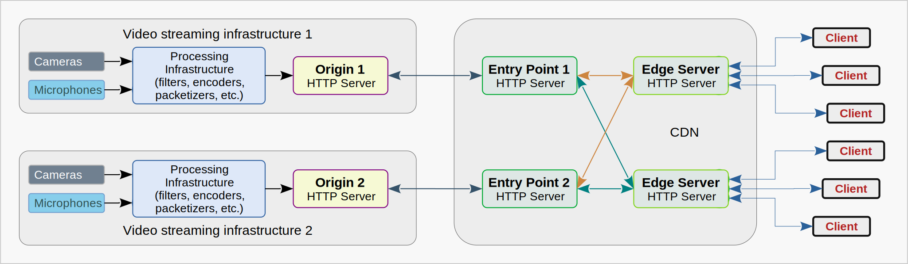
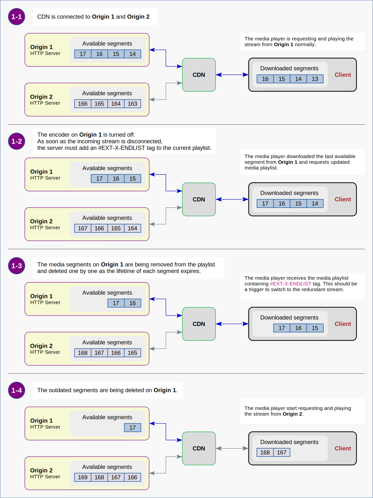

# Make HLS Great Again  

[1. Description of the Problem](#1-description-of-the-problem)  

[2. Streams from Different Origins in One Playlist](#2-streams-from-different-origins-in-one-playlist)  

[3. Publishing and Delivery](#3-publishing-and-delivery)  
&nbsp;&nbsp;[3.1. Variant 1 - CDN Specific Implementations](#31-variant-1---cdn-specific-implementations)  
&nbsp;&nbsp;&nbsp;&nbsp;[3.1.1. CDN for HLS only](#311-cdn-for-hls-only)  
&nbsp;&nbsp;&nbsp;&nbsp;[3.1.2. Publishing Methods](#312-publishing-methods)  
&nbsp;&nbsp;&nbsp;&nbsp;[3.1.3. Master Playlists](#313-master-playlists)  
&nbsp;&nbsp;&nbsp;&nbsp;[3.1.4. Triggers to Use a Redundant Stream](#314-triggers-to-use-a-redundant-stream)  
&nbsp;&nbsp;[3.2. Variant 2 - Hybrid Implementation](#32-variant-2---hybrid-implementation)  
&nbsp;&nbsp;&nbsp;&nbsp;[3.2.1. Regular CDN for HTTP content](#321-regular-cdn-for-http-content)  
&nbsp;&nbsp;&nbsp;&nbsp;[3.2.2. Publishing Methods](#322-publishing-methods)  
&nbsp;&nbsp;&nbsp;&nbsp;[3.2.3. Master Playlists](#323-master-playlists)  
&nbsp;&nbsp;&nbsp;&nbsp;[3.2.4. Triggers to Use a Redundant Stream](#324-triggers-to-use-a-redundant-stream)  

[4. Switching to a Redundant Stream](#4-switching-to-a-redundant-stream)  

[0x00. User Experience First](#0x00-user-experience-first)  

---


#### &nbsp; Introduction  

This is a continuation of [the story](https://2g-lab.github.io/2G-Notes/4600.what-is-wrong-with-HLS/HLS-Study-4600.html)
about the principles of building a video streaming system based on the HLS protocol.  
My previous note focused on
a [proper configuration](https://2g-lab.github.io/2G-Notes/4600.what-is-wrong-with-HLS/HLS-Study-4600.html#6)
of the Content Delivery Network (CDN) to avoid (or handle) misbehavior of some its subsystems.  
However, even with a properly configured CDN, one fundamental problem remains - how to provide a good user experience
when one of the origin servers becomes unavailable due to some kind of outage, network failure or maintenance.  

To fully understand what will be discussed, I would recommend you to read sections  
[1. Brief Description of the System](https://2g-lab.github.io/2G-Notes/4600.what-is-wrong-with-HLS/HLS-Study-4600.html#1)
and
[2. Known Issues](https://2g-lab.github.io/2G-Notes/4600.what-is-wrong-with-HLS/HLS-Study-4600.html#2).  

---


## 1. Description of the Problem  

Let us look at
[the system](https://2g-lab.github.io/2G-Notes/4600.what-is-wrong-with-HLS/HLS-Study-4600.html#1)
described in the previous note.  

The system includes two video infrastructures and a regular CDN for delivery an HTTP content.
Exit points of the video infrastructures are servers for publishing HLS streams, known as **origin servers**.
Each origin server publishes a master playlist, current media playlist and current collection of media fragments.  

&nbsp;  
**Master playlists** on both servers are the **same** and look something like this:  
```shell
#EXTM3U
#EXT-X-VERSION:3
#EXT-X-STREAM-INF:BANDWIDTH=3600000,CODECS="avc1.640028,mp4a.40.2",RESOLUTION=1920x1080
FHD/chunklist.m3u8
#EXT-X-STREAM-INF:BANDWIDTH=1200000,CODECS="avc1.64001f,mp4a.40.2",RESOLUTION=960x540
qHD/chunklist.m3u8
#EXT-X-STREAM-INF:BANDWIDTH=400000,CODECS="avc1.640015,mp4a.40.2",RESOLUTION=480x270
sHD/chunklist.m3u8

```

&nbsp;  
**Media playlists** (chunklists) on each server are **unique** and contain different HLS sequences.  
HLS sequences in chunklists of different resolutions on the same origin server are identical.  

For example, the chunklists for FHD, qHD and sHD resolutions that are published at some given moment of time might look like these:  
```shell
#EXTM3U
#EXT-X-VERSION:3
#EXT-X-TARGETDURATION:2
#EXT-X-MEDIA-SEQUENCE:281
#EXTINF:2.0,
media_281.ts
#EXTINF:2.0,
media_282.ts
#EXTINF:2.0,
media_283.ts
#EXTINF:2.0,
media_284.ts

```
&nbsp;&nbsp;*The current chunklist on the **Origin 1***  

```shell
#EXTM3U
#EXT-X-VERSION:3
#EXT-X-TARGETDURATION:2
#EXT-X-MEDIA-SEQUENCE:72
#EXTINF:2.0,
media_72.ts
#EXTINF:2.0,
media_73.ts
#EXTINF:2.0,
media_74.ts
#EXTINF:2.0,
media_75.ts

```
&nbsp;&nbsp;*The current chunklist on the **Origin 2***  

At any given time, the CDN receives data from only one of the origin servers.
When the CDN switches, for example, from **Origin 1** to **Origin 2**,
the client will receive the chunklist that is inconsistent with the previous one.
Then the player detects that the HLS sequence has changed downwards **(from 281 to 72)** and,
in accordance with the restriction described in
the [RFC-8216](https://datatracker.ietf.org/doc/html/rfc8216#section-6.2.2),
stops downloading media fragments, since it considers the media playlist **invalid**.  
The playback stops.  
And that is the problem!  

---

In next sections I will discuss one of the possible approaches
to solve the problem of resuming video playback without user interaction.  

&nbsp;:::&nbsp;Let me note right away that, from my point of view,
this is far from the best method to provide a good user experience.  
However, since this approach is quite simple to implement and widely used in HLS delivery services,
it deserves some attention.  

---


## 2. Streams from Different Origins in One Playlist  

The essence of the basic idea is that
the master playlist contains links to media playlists
published by **Origin 1** and **Origin 2** together.  
```shell
#EXTM3U
#EXT-X-VERSION:3
#EXT-X-STREAM-INF:BANDWIDTH=3600000,CODECS="avc1.640028,mp4a.40.2",RESOLUTION=1920x1080
origin_1/FHD/chunklist.m3u8
#EXT-X-STREAM-INF:BANDWIDTH=3600000,CODECS="avc1.640028,mp4a.40.2",RESOLUTION=1920x1080
origin_2/FHD/chunklist.m3u8
#EXT-X-STREAM-INF:BANDWIDTH=1200000,CODECS="avc1.64001f,mp4a.40.2",RESOLUTION=960x540
origin_1/qHD/chunklist.m3u8
#EXT-X-STREAM-INF:BANDWIDTH=1200000,CODECS="avc1.64001f,mp4a.40.2",RESOLUTION=960x540
origin_2/qHD/chunklist.m3u8
#EXT-X-STREAM-INF:BANDWIDTH=400000,CODECS="avc1.640015,mp4a.40.2",RESOLUTION=480x270
origin_1/sHD/chunklist.m3u8
#EXT-X-STREAM-INF:BANDWIDTH=400000,CODECS="avc1.640015,mp4a.40.2",RESOLUTION=480x270
origin_2/sHD/chunklist.m3u8

```

Thus, if the current media playlist becomes unavailable, the player should switch to the redundant media playlist.  

This approach opens up possibilities many implementation options.  

---


## 3. Publishing and Delivery  

### 3.1. Variant 1 - The CDN Specific Implementations  

#### 3.1.1. CDN for HLS only  

This solution uses a special CDN configuration customized for the specific task of delivering HLS content.  
In this configuration, the CDN provides access to both origin servers simultaneously.
This means that if both origin servers are accessible and operational, the client can request content from any of them by its choice.  

  
&nbsp;&nbsp;*Figure 3.1.1. : The CDN specialized for HLS delivery provides access to all origin servers simultaneously.*  


#### 3.1.2. Publishing Methods  

There are two publishing methods widely used with similar CDN implementations:  
- **HLS Push** is when the origin server uploads HLS data to the entry point server
  using the [HTTP PUT method](https://developer.mozilla.org/en-US/docs/Web/HTTP/Methods/PUT).  
- **HLS Pull** is when the entry point server downloads HLS data from the origin server
  using the [HTTP GET method](https://developer.mozilla.org/en-US/docs/Web/HTTP/Methods/GET).  


#### 3.1.3. Master Playlists  

The master playlists for these configurations are usually prepared manually and stored directly on the CDN entry point servers.  
They can contain absolute or relative paths URLs of media playlists.  

```shell
#EXTM3U
#EXT-X-VERSION:3
#EXT-X-STREAM-INF:BANDWIDTH=3600000,CODECS="avc1.640028,mp4a.40.2",RESOLUTION=1920x1080
https://cdn.edge.name/hls/live/NickName-of-EntryPoint-1/streamName/FHD/chunklist.m3u8
#EXT-X-STREAM-INF:BANDWIDTH=3600000,CODECS="avc1.640028,mp4a.40.2",RESOLUTION=1920x1080
https://cdn.edge.name/hls/live/NickName-of-EntryPoint-2/streamName/FHD/chunklist.m3u8
#EXT-X-STREAM-INF:BANDWIDTH=1200000,CODECS="avc1.64001f,mp4a.40.2",RESOLUTION=960x540
https://cdn.edge.name/hls/live/NickName-of-EntryPoint-1/streamName/qHD/chunklist.m3u8
#EXT-X-STREAM-INF:BANDWIDTH=1200000,CODECS="avc1.64001f,mp4a.40.2",RESOLUTION=960x540
https://cdn.edge.name/hls/live/NickName-of-EntryPoint-2/streamName/qHD/chunklist.m3u8
#EXT-X-STREAM-INF:BANDWIDTH=400000,CODECS="avc1.640015,mp4a.40.2",RESOLUTION=480x270
https://cdn.edge.name/hls/live/NickName-of-EntryPoint-1/streamName/sHD/chunklist.m3u8
#EXT-X-STREAM-INF:BANDWIDTH=400000,CODECS="avc1.640015,mp4a.40.2",RESOLUTION=480x270
https://cdn.edge.name/hls/live/NickName-of-EntryPoint-2/streamName/sHD/chunklist.m3u8

```
&nbsp;&nbsp;*An example of the master playlist containing **absolute URL**s.*  
&nbsp;&nbsp;*Such type of playlists are typically used with the **HLS Push** method.*  

&nbsp;  

```shell
#EXTM3U
#EXT-X-VERSION:3
#EXT-X-STREAM-INF:BANDWIDTH=3600000,CODECS="avc1.640028,mp4a.40.2",RESOLUTION=1920x1080
NickName-of-Origin-1/streamName/FHD/chunklist.m3u8
#EXT-X-STREAM-INF:BANDWIDTH=3600000,CODECS="avc1.640028,mp4a.40.2",RESOLUTION=1920x1080
NickName-of-Origin-2/streamName/FHD/chunklist.m3u8
#EXT-X-STREAM-INF:BANDWIDTH=1200000,CODECS="avc1.64001f,mp4a.40.2",RESOLUTION=960x540
NickName-of-Origin-1/streamName/qHD/chunklist.m3u8
#EXT-X-STREAM-INF:BANDWIDTH=1200000,CODECS="avc1.64001f,mp4a.40.2",RESOLUTION=960x540
NickName-of-Origin-2/streamName/qHD/chunklist.m3u8
#EXT-X-STREAM-INF:BANDWIDTH=400000,CODECS="avc1.640015,mp4a.40.2",RESOLUTION=480x270
NickName-of-Origin-1/streamName/sHD/chunklist.m3u8
#EXT-X-STREAM-INF:BANDWIDTH=400000,CODECS="avc1.640015,mp4a.40.2",RESOLUTION=480x270
NickName-of-Origin-2/streamName/sHD/chunklist.m3u8

```
&nbsp;&nbsp;*An example of the master playlist containing **relative URL**s.*  
&nbsp;&nbsp;*Such type of playlists are typically used with the **HLS Pull** method.*  

&nbsp;  

As you understand, the URLs in the playlists here are **not** the actual resource paths. They only pretend to be so.
To be able to fetch data from the origin or entry point servers,
the CDN must translate the URLs listed in the playlist into actual URLs.  


#### 3.1.4. Triggers to Use a Redundant Stream  

For the client, **HLS Push** and **HLS Pull** implementations differ from each other in the types of errors
that the client receives if one of the subsystems fails.  

Let us look at some obvious examples.  

#### &nbsp; HLS Push  
- The origin server stops sending HLS data to the entry point server for any reason
  (maintenance of the origin server or network components, network failure, etc.).  
  &nbsp;  
  Therefore, the HLS data at the entry point server is not being updated.  
  This will cause the entry point server to respond to the client with a **stale media playlist** or `404 status code`.  

&nbsp;  

#### &nbsp; HLS Pull  
- The origin server has been properly stopped for maintenance.  
  &nbsp;  
  TCP connections from the entry point server may be either REJECTED or DROPPED (bad choice) by the firewall.  
  (For example, as it has been shown [here](https://2g-lab.github.io/2G-Notes/4600.what-is-wrong-with-HLS/HLS-Study-4600.html#1-4-2).)  
  &nbsp;  
  If the firewall uses the `REJECT` rule, it will send
  a TCP [RESET](https://datatracker.ietf.org/doc/html/rfc9293#name-reset-processing) packet
  in response to the entry point attempt to establish a TCP connection with the origin server.  
  In such a case, the entry point server should immediately generate a server-error response containing a `503 status code`
  ([Service Unavailable](https://developer.mozilla.org/en-US/docs/Web/HTTP/Status/503)) and send it to the client.  
  &nbsp;  
  If the firewall uses the `DROP` rule, it will simply ignore any incoming TCP packets.
  This will cause the entry point server, when attempting to establish a TCP connection with the origin server,
  to wait for some time and then generate a server-error response containing a `504 status code`
  ([Gateway Timeout](https://developer.mozilla.org/en-US/docs/Web/HTTP/Status/504)) and send it to the client.  
  In general, the waiting time can be quite long **(!)**.
  But in real life, an adequately configured CDN will rarely wait longer than 2 seconds.  
  &nbsp;  
- An HTTP server on the origin server is down.  
- The origin server is turned off.  
- There is no network connection.  
  &nbsp;  
  These situations lead to the same consequences as the `DROP` firewall rule.  
  &nbsp;  
- The HTTP server on the origin server is running but an encoding process has stopped functioning properly.  
  &nbsp;  
  Since in this case there is no HLS data to publish, when the entry-point server requests this data
  the origin server will generate a client-error response containing the `404 status code`
  ([Not Found](https://developer.mozilla.org/en-US/docs/Web/HTTP/Status/404)).  

Of course, there are other possibilities that something goes wrong
(problems with DNS records for origin servers, expired SSL certificates, and so on and so forth).  
There may be malfunctions of the CDN itself.  
Some CDNs may generate non-standard status codes **(!)**,
something like [this](https://community.cloudflare.com/t/community-tip-fixing-error-523-origin-is-unreachable/44218).  

---

In general, life is full of surprises.
And these surprises can be described by the idea that
**the client received something different, instead of what it expected to receive**.  
Such events must be detected and handled by the HLS player itself or its wrapper application.  

Note that, unlike the
[behavior of the regular CDN](https://2g-lab.github.io/2G-Notes/4600.what-is-wrong-with-HLS/HLS-Study-4600.html#1-3-3),
the specialized CDN does nothing with the error responses other than forward them to clients.  

---


  
&nbsp;&nbsp;
*Figure 3.1.4. : The media player switches to a redundant stream after the encoder has failed.*
*(Honestly, I have never seen exactly this event in real life.)*  

---


### 3.2. Variant 2 - The Hybrid Implementation  

#### 3.2.1. Regular CDN for HTTP content  

This solution uses a regular CDN configuration, the same as for any HTTP content.  
In this configuration, the CDN provides access to the primary origin server
and switches to the backup server only in certain circumstances.
This means that only one origin server is accessible at some particular moment of time
(and you do not know exactly, which one).  

  
&nbsp;&nbsp;*Figure 3.2.1. : The regular CDN provides access to the currently active origin server.*  


#### 3.2.2. Publishing Methods  

Obviously, there is only one publishing method for such CDN implementation:  
- **HLS Pull** is when the entry point server downloads HLS data from the origin server
  using the [HTTP GET method](https://developer.mozilla.org/en-US/docs/Web/HTTP/Methods/GET).  


#### 3.2.3. Master Playlists  

The master playlists for this configuration are usually generated dynamically and stored on the origin servers.  
They must contain relative URLs to media playlists.  

The requirement to use relative URLs in master playlists is not obvious at first glance.
But if we consider the possibility of using several CDNs simultaneously, then it seems natural.  

It is important that the playlists on both servers must be identical.
Thus, each origin server must generate a playlist containing links to the streams that are published on that server
as well as the streams that are **not** published on that server.  

```shell
#EXTM3U
#EXT-X-VERSION:3
#EXT-X-STREAM-INF:BANDWIDTH=3600000,RESOLUTION=1920x1080
FHD-chunklist-available-on-Origin-1.m3u8
#EXT-X-STREAM-INF:BANDWIDTH=3600000,RESOLUTION=1920x1080
FHD-chunklist-available-on-Origin-2.m3u8
#EXT-X-STREAM-INF:BANDWIDTH=1200000,RESOLUTION=960x540
qHD-chunklist-available-on-Origin-1.m3u8
#EXT-X-STREAM-INF:BANDWIDTH=1200000,RESOLUTION=960x540
qHD-chunklist-available-on-Origin-2.m3u8
#EXT-X-STREAM-INF:BANDWIDTH=400000,RESOLUTION=480x270
sHD-chunklist-available-on-Origin-1.m3u8
#EXT-X-STREAM-INF:BANDWIDTH=400000,RESOLUTION=480x270
sHD-chunklist-available-on-Origin-2.m3u8

```
&nbsp;&nbsp;*Here is an illustration of what I mean.*  

---

Let us look at an example of how [Wowza Streaming Engine](https://www.wowza.com/streaming-engine),
acting as an origin server, can generate these types of playlists.  

A standard method to combine several streams with different bitrates into a group
for [adaptive bitrate streaming](https://www.wowza.com/docs/how-to-do-adaptive-bitrate-streaming)
is to use [SMIL](https://en.wikipedia.org/wiki/Synchronized_Multimedia_Integration_Language) files.  

```xml
<?xml version="1.0" encoding="UTF-8"?>
<smil>
  <body>
    <switch>
      <video title="FHD_Origin_1" src="Real_FHD_Stream" width="1920" height="1080" systemLanguage="eng" system-bitrate="3600000"></video>
      <video title="FHD_Origin_2" src="Fake_FHD_Stream" width="1920" height="1080" systemLanguage="eng" system-bitrate="3600000"></video>
      <video title="qHD_Origin_1" src="Real_qHD_Stream" width="960"  height="540"  systemLanguage="eng" system-bitrate="1200000"></video>
      <video title="qHD_Origin_2" src="Fake_qHD_Stream" width="960"  height="540"  systemLanguage="eng" system-bitrate="1200000"></video>
      <video title="sHD_Origin_1" src="Real_sHD_Stream" width="480"  height="270"  systemLanguage="eng" system-bitrate="400000" ></video>
      <video title="sHD_Origin_2" src="Fake_sHD_Stream" width="480"  height="270"  systemLanguage="eng" system-bitrate="400000" ></video>
    </switch>
  </body>
</smil>
```
&nbsp;&nbsp;*The SMIL file to generate the master playlist on **Origin 1**.*  

```xml
<?xml version="1.0" encoding="UTF-8"?>
<smil>
  <body>
    <switch>
      <video title="FHD_Origin_1" src="Fake_FHD_Stream" width="1920" height="1080" systemLanguage="eng" system-bitrate="3600000"></video>
      <video title="FHD_Origin_2" src="Real_FHD_Stream" width="1920" height="1080" systemLanguage="eng" system-bitrate="3600000"></video>
      <video title="qHD_Origin_1" src="Fake_qHD_Stream" width="960"  height="540"  systemLanguage="eng" system-bitrate="1200000"></video>
      <video title="qHD_Origin_2" src="Real_qHD_Stream" width="960"  height="540"  systemLanguage="eng" system-bitrate="1200000"></video>
      <video title="sHD_Origin_1" src="Fake_sHD_Stream" width="480"  height="270"  systemLanguage="eng" system-bitrate="400000" ></video>
      <video title="sHD_Origin_2" src="Real_sHD_Stream" width="480"  height="270"  systemLanguage="eng" system-bitrate="400000" ></video>
    </switch>
  </body>
</smil>
```
&nbsp;&nbsp;*The SMIL file to generate the master playlist on **Origin 2**.*  

As you can see, there are lines containing `Real` and `Fake` names of the source streams.  
The streams with `Real` names are incoming streams connected to `Wowza Streaming Engine`.  
The streams with `Fake` names do not exist on servers.  
The lines with `Fake` stream names are used in SMIL files to add corresponding lines to the playlists.  

So, based on these SMIL files each origin server will generate the following master playlist:
```shell
#EXTM3U
#EXT-X-VERSION:3
#EXT-X-STREAM-INF:BANDWIDTH=3600000,NAME="FHD_Origin_1",RESOLUTION=1920x1080
chunklist_b3600000_sleng_HASH-1.m3u8
#EXT-X-STREAM-INF:BANDWIDTH=3600000,NAME="FHD_Origin_2",RESOLUTION=1920x1080
chunklist_b3600000_sleng_HASH-2.m3u8
#EXT-X-STREAM-INF:BANDWIDTH=1200000,NAME="qHD_Origin_1",RESOLUTION=960x540
chunklist_b1200000_sleng_HASH-3.m3u8
#EXT-X-STREAM-INF:BANDWIDTH=1200000,NAME="qHD_Origin_1",RESOLUTION=960x540
chunklist_b1200000_sleng_HASH-4.m3u8
#EXT-X-STREAM-INF:BANDWIDTH=400000,NAME="sHD_Origin_1",RESOLUTION=480x270
chunklist_b400000_sleng_HASH-5.m3u8
#EXT-X-STREAM-INF:BANDWIDTH=400000,NAME="sHD_Origin_1",RESOLUTION=480x270
chunklist_b400000_sleng_HASH-6.m3u8

```
Where `HASH-(1/2/3/4/5/6)` is a value generated based on the properties of the stream (BANDWIDTH,NAME,RESOLUTION).  

---


#### 3.2.4. Triggers to Use a Redundant Stream  

In contrast to the specialized CDN behavior,
a regular CDN does not send server-error responses to clients, when one of the subsystems fails.
Instead, any server-error responses generated by the entry point servers (or intermediate CDN nodes) are forwarded
to the [health check system](https://2g-lab.github.io/2G-Notes/4600.what-is-wrong-with-HLS/HLS-Study-4600.html#1-3-4).  
Thus, in almost all cases described in [Section 3.1.4.](#314-triggers-to-use-a-redundant-stream) (examples for **HLS Pull** method),
the CDN will start forwarding requests to the alternative origin server.  

Inasmuch as the names of the `Real` streams on **Origin 1** match the names of the `Fake` streams on **Origin 2** (and vice versa),
the client will receive an error response containing a `404 status code`
immediately after the CDN switches to the alternative origin server.  

---

#### &nbsp; Note:  

There is one special failure case which is critical for this type of system:  

> - The HTTP server on the origin server is running but an encoding process has stopped.  
  &nbsp;  
  Since in this case there is no HLS data to publish, when the entry-point server requests this data,
  the origin server will generate a client-error response containing the `404 status code`
  ([Not Found](https://developer.mozilla.org/en-US/docs/Web/HTTP/Status/404)).  

Since this error is indistinguishable from the error that happens after the CDN failover
(switching to the alternative origin server), it cannon be handled by the CDN.
As a result, the media player will trap into an error loop, requesting non-existent streams from the current origin.  

Therefore, you have to take measures to avoid or prevent such situations.
For example, you can use an application to monitor the status of the encoding process
and apply a `REJECT` firewall rule to cause the CDN to switch to the alternative origin.  

---


  
&nbsp;&nbsp;
*Figure 3.2.4. : The media player switches to a redundant stream after the origin server has been entered to maintenance mode.*  

---


## 4. Switching to a Redundant Stream  

I believe it would be great if stream failure handling functionality
was built into the media player itself at a fairly low level.
Then, the reaction time to events signaling the need to switch to a redundant stream could be reduced to the minimum,
and the switching itself would appear almost imperceptible to the end user.  

Though, at the time I encountered this problem,
the player that I was supposed to use was not able to correctly handle such events.
Therefore, I happened to write a simple wrapper for the player that listens to the player events
and, if necessary, causes it to play an alternative stream after restart.  

Here is a [repository](https://github.com/2G-Lab/2G-Wrapper-HLS) with this code.  

---


#### &nbsp; Note:  
An attentive reader will point out to the factors
which affect the time, for which video playback is interrupted,
when the player switches to an alternative stream.  

- The wrapper interacts with the media player using the event mechanism and player's API.  
  This means that first an error response is processed by the media player itself,
  and only after that the player emits an event that can be handled externally.  
  &nbsp;:::&nbsp;If I understand programming correctly,
  the event exchange mechanism is an expensive activity in terms of time consumption.  

As the wrapper restarts the media player, some essentially unnecessary steps are performed.

- The player is destroyed and a new player instance is created.  
  Honestly, I think this action should not take much time
  since the player code is already converted to bytecode and stored in memory.  

- The HLS manifest is loaded again.  
  This can take considerable time, especially on networks with long pings.  
  (For example, when using a 4G mobile network, downloading the manifest file may take up to 0.5 seconds.)  

- The HLS manifest is parsed again.  
  I think this should happen quickly, but still worth mentioning.

Obviously, using such an approach to solving this problem
leads to extremely irrational expenditure of resources, primarily time.  
The only advantage of this approach is the ease of implementation (it is fast and cheap).  
&nbsp;:::&nbsp;Such solutions probably should not be used for systems that you would like to be proud of.  

However, despite all of the above, if the client's network condition is good enough,
the time for which video playback stops is usually something about `0.6`-`1.0` second.  

It is important to note that if all components of your system are well configured, if they work reliably enough,
then events when the player needs to switch to an alternative stream occur quite rarely.  

Thus, in some cases, using this approach may be economically justified. &#x1F917;  

---


## 0x00. User Experience First  

Reflecting on the intricacies of the technologies and engineering solutions discussed in this note,
I cannot shake the feeling that this is all wrong.
By trying to solve a fairly simple problem, we complicate the entire system.
We figure out how to modify the operation of the origin server, CDN, media player,
just to workaround two limitations imposed by
the [HLS protocol specification](https://datatracker.ietf.org/doc/html/rfc8216)
and [Media Source Extensions](https://w3c.github.io/media-source/).
The result is still unsatisfactory, to be honest.  

Here I would like to propose a way to provide a great user experience
while maintaining the simplicity and reliability of a **live** video streaming system.  

We must return to the simplest
[system structure](https://2g-lab.github.io/2G-Notes/4600.what-is-wrong-with-HLS/HLS-Study-4600.html#1):  

- We need to use the normal master playlist on the origin servers,
  such as the one shown in [this note (Section 1)](#1-description-of-the-problem).  

- We need to use a regular CDN that just switches to the backup origin server
  when a fault of the network or the primary origin server has been detected.  

As shown in [my previous note (Section 2)](https://2g-lab.github.io/2G-Notes/4600.what-is-wrong-with-HLS/HLS-Study-4600.html#2),
such a system violates the HLS protocol specification [requirement](https://datatracker.ietf.org/doc/html/rfc8216#section-6.2.2)  
that the value of `EXT-X-MEDIA-SEQUENCE` tag MUST NOT decrease or wrap.  
But this is exactly what happens when the CDN switches to an alternative origin server.  

Moreover, the timestamps in two media segments, delivered in a row from different origin servers, are **not** in sequence.
This means that if you simply append these segments one by one
to the [SourceBuffer](https://developer.mozilla.org/en-US/docs/Web/API/SourceBuffer)
of [MediaSource object](https://developer.mozilla.org/en-US/docs/Web/API/MediaSource),
the video element will not play them continuously.  

To resolve these problems, the media player functionality needs to be adapted (expanded) to such a system:  

- When playing a **live** stream, the media player must ignore the `EXT-X-MEDIA-SEQUENCE` tag in a media playlist.  
  Instead, it must simply download the last media segment from the updated media playlist.  

- The media player must check and, if needed, change the timestamps of each frame in each media segment
  so that they represent a growing sequence with the correct interval.  
  After this, media segments with modified timestamps can be appended to the buffer of `MediaSource` object
  for further demultiplexing, decoding and playing.  

Despite the fact that technically this is not a difficult task, there will be no implementation examples in this section.  

---

2G - 4608
